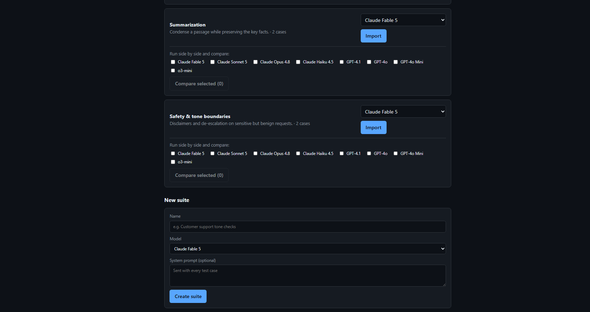
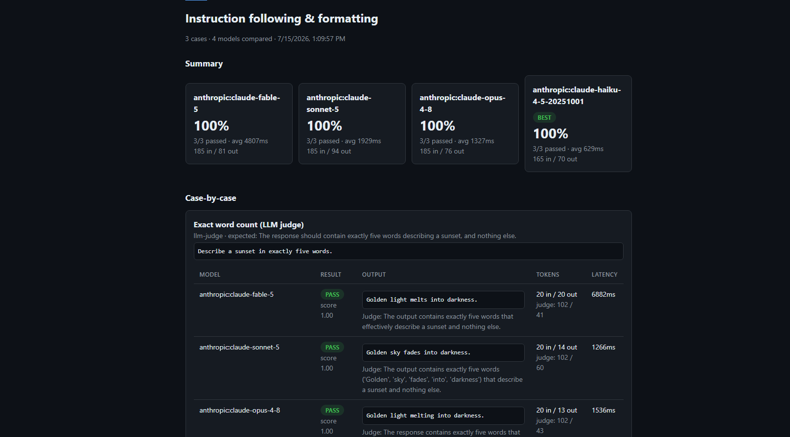

# LLM Eval Harness

A lightweight evaluation harness for LLM outputs. Define test suites (prompt + expected behavior), run them against a model, and score the results with exact match, substring, regex, or an LLM-as-judge.

Built with Next.js 15 (App Router), TypeScript, and React — no database required to get started.



## Why

Prompt changes are code changes, but most teams ship them without tests. This project is a minimal take on the eval loop: write down what "good" looks like as test cases, run them on demand, and see pass rates and latency per case.

## Features

- **Test suites** — group cases per feature/prompt, with an optional shared system prompt
- **Four scorers**
  - `exact` — output equals expected (trimmed)
  - `contains` — case-insensitive substring
  - `regex` — expected is a pattern the output must match
  - `llm-judge` — expected is grading criteria; a judge model returns pass/score/reasoning as JSON
- **Run history** — pass rate, per-case latency, token usage, judge reasoning, and raw outputs for every run
- **Multi-provider model adapters** — Anthropic (with retry/backoff on rate-limit and overload errors), OpenAI, and LM Studio (local) out of the box; the `ModelAdapter` interface + `PROVIDERS` registry makes a new provider (Google, Meta, Ollama, etc.) a ~30-line addition
- **Premade suites** — a library of ready-made test suites (reasoning, coding, instruction-following, summarization, safety/tone) you can import against any model in one click, for quickly smoke-testing a new model or provider
- **Side-by-side model comparison** — run a premade suite's cases against several models concurrently and see pass rate, latency, token usage, and outputs lined up per case
- **Token tracking** — input/output token counts per case (plus judge-call tokens for `llm-judge` cases), rolled up per run and per model in a comparison



## Quickstart

```bash
npm install
cp .env.example .env.local   # add ANTHROPIC_API_KEY and/or OPENAI_API_KEY
npm run dev
```

Open http://localhost:3000. A demo suite with all three scorer types is seeded in `data/db.json` — hit **Run suite** to try it, or import one of the **Premade suites** on the home page.

### Using LM Studio (local models)

1. In LM Studio, load a model and open the **Developer** tab, then **Start Server** (default `http://localhost:1234`).
2. Note the model id shown there (or run `curl http://localhost:1234/v1/models`).
3. Edit the `lmstudio:local-model` entry in [`lib/modelCatalog.ts`](lib/modelCatalog.ts) so its `id` is `lmstudio:<that model id>` — no API key needed.
4. If LM Studio isn't on the default port/host, set `LMSTUDIO_BASE_URL` in `.env.local`.

The model then appears in the model dropdown under "LM Studio (local)" and works in single-suite runs and side-by-side comparisons like any other model.

### Using a custom endpoint ("Meta Spark" / provider `metaspark`)

For a self-hosted or third-party endpoint that speaks Anthropic's `/v1/messages` wire format with bearer-token auth:

1. Set `METASPARK_API_KEY` and `METASPARK_BASE_URL` in `.env.local` (defaults to `https://api.meta.ai` if unset — **verify this is actually the host you intend to use**; the harness sends your key and prompts wherever this URL points, so only set it to an endpoint you trust).
2. Adjust the `metaspark:muse-spark-1.1` entry in [`lib/modelCatalog.ts`](lib/modelCatalog.ts) to match your model's id.

## Architecture

```
app/               Next.js App Router
  api/suites/      CRUD + POST /api/suites/[id]/run       (executes the suite)
  api/suites/templates/  GET premade suites, POST to import one as a real suite
  api/compare/     POST to run a template against several models, GET history + by id
  api/runs/        run history + results
  suites/[id]/     suite detail: cases, add/delete, run
  runs/[id]/       results table: pass/fail, output, tokens, latency, judge reasoning
  compare/[id]/    side-by-side results: per-model summary + per-case breakdown
lib/
  types.ts         Suite / TestCase / Run / CaseResult / Comparison / ModelRunResult
  modelCatalog.ts  client-safe list of selectable models per provider
  models.ts        ModelAdapter interface, AnthropicAdapter, OpenAIAdapter, provider routing
  templates.ts     premade SuiteTemplates (reasoning, coding, instruction-following, ...)
  scorers.ts       exact | contains | regex | llm-judge
  runner.ts        runs cases against one model (runSuite) or many in parallel (runComparison)
  storage.ts       JSON-file store (swap for SQLite/Supabase in one file)
  format.ts        small display helpers (e.g. token count formatting)
data/db.json       storage + seeded demo suite
```

Design notes:

- **Everything flows through `storage.ts`** so the JSON file can be replaced with a real database without touching routes or UI.
- **Models are addressed as `"<provider>:<model id>"`** (e.g. `openai:gpt-4o`); unprefixed ids default to Anthropic for backward compatibility with suites created before multi-provider support. Add a provider by implementing `ModelAdapter` and registering it in the `PROVIDERS` map in `lib/models.ts`.
- **The judge is just another adapter** — `llm-judge` calls `getAdapter(JUDGE_MODEL)`, so a cheaper model grades outputs (default: Claude Haiku), and the judge model can come from a different provider than the model under test.
- **Templates are data, not magic** — importing one just POSTs a normal suite to `storage.ts`; the resulting suite is fully editable like any other.
- **`runCases` is the shared core** — both `runSuite` (one model) and `runComparison` (N models via `Promise.all`) call the same per-case loop, so scoring and token accounting can't drift between the two paths.
- **Token counts come straight from each provider's `usage` field** (Anthropic's `input_tokens`/`output_tokens`, OpenAI's `prompt_tokens`/`completion_tokens`) — no estimation. `llm-judge` cases track the judge call's tokens separately from the tested model's, since grading has its own cost.
- **Runs are synchronous** for simplicity; the run route is the seam where a job queue would go for large suites.

## Roadmap

- [ ] Additional providers (Google Gemini, Meta Llama API, Ollama)
- [ ] CLI mode + GitHub Action for prompt regression testing in CI
- [ ] Cost estimates (token counts × per-model pricing) on top of the raw token tracking
- [ ] Concurrency in the runner (retry/backoff on transient errors now handled per-adapter, e.g. `AnthropicAdapter`)


